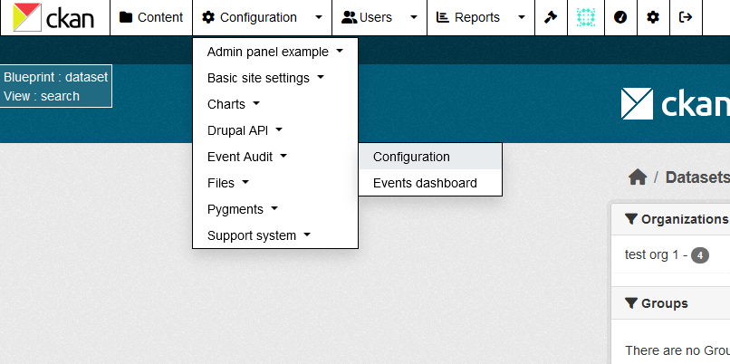
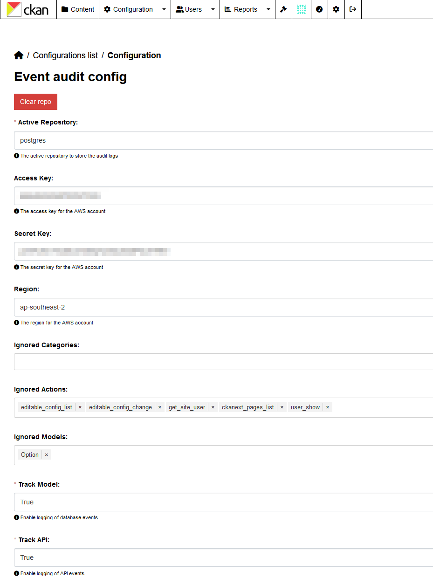

We have an integration with the `ckanext-admin-panel` extension, which allows you to manage the CKAN configuration from the web interface. To enable this integration, you need to install the `ckanext-admin-panel` extension and configure it as described in the [`ckanext-admin-panel documentation`](https://github.com/DataShades/ckanext-admin-panel).



???+ Note
    The admin panel is available only for `sysadmin` users.

By default, the admin pages are not being registered. But if you want to enable it, you can set the respective option to `true` in your CKAN configuration file.

```ini
ckanext.event_audit.enable_admin_panel = true
```

## Configuration with `ckanext-admin-panel`

The `ckanext-admin-panel` allows you to configure the extension in real time from the web interface.


