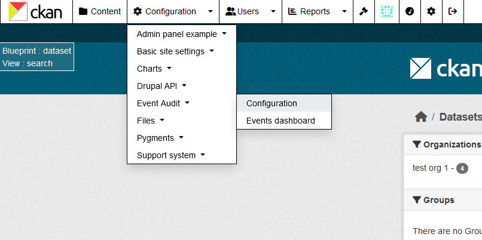
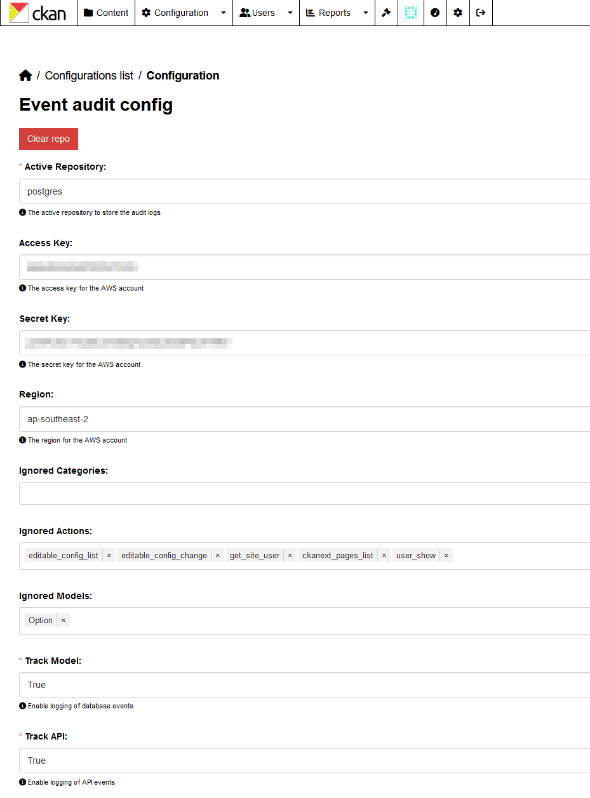

# Admin panel and dashboard

## Events dashboard

The extension ships a dashboard listing the recorded events, with filtering, sorting, export and
delete actions. It is available at `/event_audit/dashboard`, for `sysadmin` users only, who also get a link to it
in the header.

The dashboard is built on [ckanext-tables](https://github.com/DataShades/ckanext-tables), which
is optional: install the extension with the `dashboard` extra to get it. Without it, there's no
dashboard, and no link to it. With it, the `tables` plugin must be enabled as well, or the page
fails with a `TemplateNotFound` error:

```ini
ckan.plugins = ... tables event_audit ...
```

The dashboard is registered whether or not the admin panel integration below is enabled.

With the Postgres repository the table is filtered, sorted and paginated by the database. The
other repositories can't do that, so they load the events matching the filters they understand
into memory first. Prefer the [Postgres repository](../repositories/postgres.md) if you have
a lot of events.

## Integration with `ckanext-admin-panel`

We have an integration with the `ckanext-admin-panel` extension, which allows you to manage the
CKAN configuration from the web interface. To use it, install `ckanext-admin-panel` and configure
it as described in the [`ckanext-admin-panel documentation`](https://github.com/DataShades/ckanext-admin-panel).



???+ Note
    The admin panel is available only for `sysadmin` users.

When the `admin_panel` plugin is enabled, the integration is **on by default**: an "Event Audit"
section appears in the admin panel with a configuration page
(`/admin-panel/event_audit/config`) and a link to the dashboard. To turn it off, set:

```ini
ckanext.event_audit.enable_admin_panel = false
```

## Configuration with `ckanext-admin-panel`

The `ckanext-admin-panel` allows you to change the extension's options from the web interface.



Changes are stored in the database and applied to the running application, but not every option
is read again after the application has started:

| Option | Takes effect |
|--------|--------------|
| `ignore.categories`, `ignore.actions`, `ignore.models` | immediately |
| `track_model`, `track_api` | immediately |
| `batch.size`, `batch.timeout` | immediately (the writer thread reads them on each round) |
| `retention_days` | the next time the retention command runs |
| `cloudwatch.*` | after a restart: the client is created once |
| `batch.queue_size` | after a restart: the queue is created once, when the writer thread starts |

???+ warning
    The AWS access key and secret key are stored in the database in clear text once you save them
    here. See [Security](../security.md) for the alternatives.

The "Clear repo" button on the configuration page removes **all** the events from the active
repository, after a confirmation.
